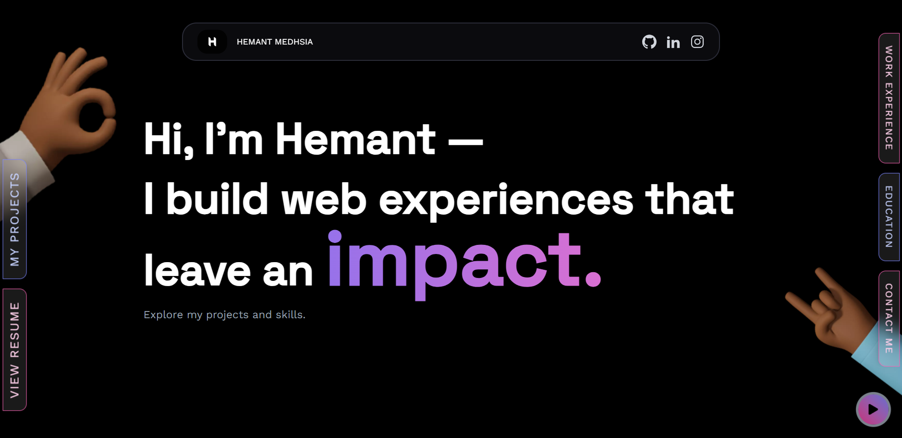

# 🚀 Hemant Medhsia's Developer Portfolio

Welcome to my **personal developer portfolio** built using **React**, **TypeScript**, **Vite**, and **Tailwind CSS**. This website is a dynamic and interactive showcase of my skills, projects, education, and experience—all wrapped in a modern, visually engaging design.



---

## 🔥 Features

- ⚡ Fast and optimized using [Vite](https://vitejs.dev/)
- 🌈 Smooth scrolling with Locomotive Scroll
- ✨ Interactive UI with Framer Motion
- 🧠 Type-safe development using TypeScript
- 🎨 Responsive & modern design with Tailwind CSS
- 💌 Contact form with form validation
- 💼 Projects, education, experience, and testimonial sections
- 🎵 Optional background music with toggle
- 🔁 Tech stack logos & marquee animations

---

## 🛠️ Tech Stack

| Category       | Technologies                                                                 |
| -------------- | ---------------------------------------------------------------------------- |
| **Frontend**   | React, TypeScript, Vite, Tailwind CSS, Framer Motion                         |
| **Routing**    | React Router DOM                                                             |
| **Animation**  | Framer Motion, Locomotive Scroll                                             |
| **Deployment** | [Vercel](https://vercel.com)                                                 |
| **Utilities**  | ESLint, Prettier, custom hooks, context API for global state                 |

---

## 📁 Project Structure Overview
<pre><code>```bash 📦 Portfolio2025/ ├── 📄 .gitignore ├── 📄 README.md ├── 📄 eslint.config.js ├── 📄 index.html ├── 📄 package.json ├── 📄 package-lock.json ├── 📄 tsconfig.json ├── 📄 tsconfig.app.json ├── 📄 tsconfig.node.json ├── 📄 vite.config.ts ├── 📄 vercel.json ├── 📁 public/ │ ├── 📄 HemantMedhsiaUpdatedResume.pdf │ ├── 🖼️ gProfile1.png │ ├── 🖼️ og-image.png │ └── 🖼️ vite.svg ├── 📁 src/ │ ├── 📄 App.css │ ├── 📄 App.tsx │ ├── 📁 Data/ │ │ └── 📄 projectsData.ts │ ├── 📁 Layout/ │ │ ├── 📄 Footer.tsx │ │ └── 📄 Header.tsx │ ├── 📁 Routes/ │ │ └── 📄 RoutesConfig.tsx │ ├── 📁 Ui/ │ │ ├── 📁 GradientLine/ │ │ │ └── 📄 GradientLine.tsx │ │ └── 📁 InputFields/ │ │ ├── 📄 TextAreaProps.tsx │ │ └── 📄 TextInputProps.tsx │ ├── 📁 apis/ │ │ └── 📁 Contactme/ │ │ └── 📄 Contactme.ts │ ├── 📁 assets/ │ │ ├── 📁 Images/ │ │ │ ├── 📁 Company/ (aradhyatechLogo.jfif, growQuestLogo.jfif, etc.) │ │ │ ├── 📁 Education/ (degree.png, fullSchollar.png, etc.) │ │ │ ├── 📁 HelperImgs/ (cropedProfile.png, SchoolCRMMain.jfif, etc.) │ │ │ ├── 📁 Numbers/ (01.svg, 02.svg, etc.) │ │ │ ├── 📁 Projects/ (PortfolioMainImg.png, EmpMainImg.png, etc.) │ │ │ └── 📁 stack/ (React.png, Tailwind.png, NodeJs.svg, etc.) │ │ ├── 📁 Sounds/ │ │ │ └── 🔊 epic.mp3 │ │ └── 📄 react.svg │ ├── 📁 components/ │ │ ├── 📁 About/ │ │ │ ├── 📄 IntroHeading.tsx │ │ │ └── 📄 ProfileSection.tsx │ │ ├── 📁 Contactme/ │ │ │ └── 📄 ContactmeHeader.tsx │ │ ├── 📁 Education/ │ │ │ ├── 📄 EducationBody.tsx, EducationCard.tsx, etc. │ │ ├── 📁 Experience/ │ │ │ ├── 📄 ExperienceBody.tsx, TimelineCard.tsx, etc. │ │ ├── 📁 Github/ │ │ │ └── 📄 Github.tsx │ │ ├── 📁 Header/ │ │ │ ├── 📄 BottomLeftRotatedButtons.tsx, etc. │ │ ├── 📁 LazyImage/ │ │ │ ├── 📄 LazyImage.tsx, LazyMotionImage.tsx │ │ ├── 📁 Loader/ │ │ │ ├── 📄 Loader.module.scss, Loader.tsx │ │ ├── 📁 Marquee/ │ │ ├── 📁 MouseFollower/ │ │ ├── 📁 Music/ │ │ ├── 📁 Popups/ │ │ ├── 📁 Projects/ │ │ ├── 📁 Resume/ │ │ ├── 📁 ScrollHint/ │ │ ├── 📁 ScrollProgressBar/ │ │ ├── 📁 ScrollToTop/ │ │ ├── 📁 SmoothScrolling/ │ │ ├── 📁 TechStacksMarquee/ │ │ └── 📁 Testimonials/ │ ├── 📁 context/ │ │ └── 📄 MusicContext.tsx │ ├── 📁 pages/ │ │ ├── 📄 About.tsx, Home.tsx, Experience.tsx, etc. │ ├── 📁 types/ │ │ └── 📄 hover-effect.d.ts │ ├── 📄 index.css │ └── 📄 main.tsx ```</code></pre>

## High-Level Summary

The repository appears to be a personal portfolio website built using React, TypeScript, and Vite. The website showcases the developer's skills, experience, and projects. It features a modern design with animations, marquee effects, and a smooth scrolling experience.

## Low-Level Summary

The repository contains a React application built with Vite, a modern front-end build tool. The application is written in TypeScript and uses various libraries and frameworks, including:

* React Router for client-side routing
* Framer Motion for animations
* Locomotive Scroll for smooth scrolling
* Tailwind CSS for styling

The application consists of various components, including:

* Header and footer components
* Project cards with images, descriptions, and links
* Education and experience sections
* A testimonials section
* A contact form

The repository also includes configuration files for ESLint, TypeScript, and Vercel.

## Installing and Running Process

To install and run the application, follow these steps:

### Prerequisites

* Node.js (version  or higher)
* npm or yarn

### Installation

. Clone the repository using Git: `git clone https://github.com/HemantMedhsia/Portfolio.git`
. Navigate to the repository directory: `cd Portfolio`
. Install the dependencies using npm or yarn: `npm install` or `yarn install`

### Running the Application

. Start the development server: `npm run dev` or `yarn dev`
. Open a web browser and navigate to `http://localhost:`

The application should now be running and accessible in your web browser.

## Code Block for Installation and Running

`````bash
# Clone the repository
git clone https://github.com/HemantMedhsia/Portfolio.git

# Navigate to the repository directory
cd Portfolio

# Install the dependencies
npm install

# Start the development server
npm run dev

# Open a web browser and navigate to http://localhost:
`````
